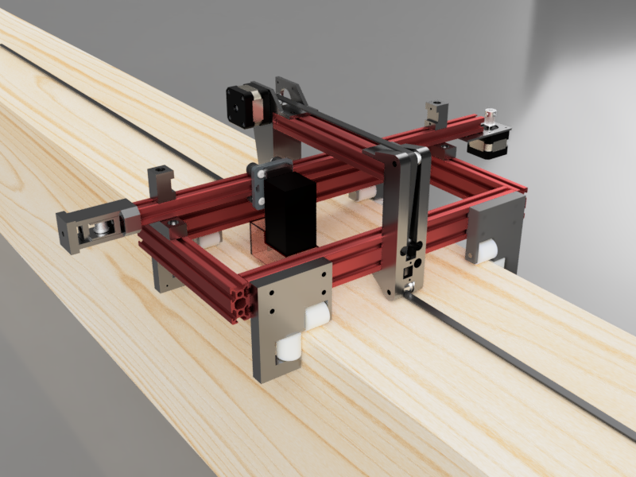

# TimberScribe Sled — Hardware Build Guide (Draft v0.1)

The sled is the self-propelled print head: a V-slot frame riding the timber on
nylon rollers, a gantry carrying a 1.6 W laser module, driven by an MKS DLC32
V2.2 controller from a Kobalt 24 V tool battery. The controller hosts its own
WiFi hotspot and takes g-code over it — there is no computer on the sled. This
guide covers printing the brackets, buying the rest, and putting it together.

> **Figure H-1 — The sled assembly (CAD render).**
>
> 
>
> *Render from `Frame.f3d`; controller and battery not shown. To be replaced
> by a photo of the sled on a squared timber with callouts on: frame rails,
> gantry, laser module, controller, battery, rollers.*

**Status: draft.** Rows marked *TBD* / *verify* need real values from the
bench. Photos land in `docs/img/`.

---

## 1. Printed parts

`3dmodels/` holds the printable parts. Convention: **`.stl` is the
print-ready truth; `.f3d`/`.f3z` is the editable Fusion 360 source** — edit
the source, re-export the STL, commit both.

| Print (`.stl`) | Qty | Source (`.f3d`) | Notes |
|---|---|---|---|
| Bridge Support | 1 | Bridge Supports.f3d | Carries a limit switch |
| Bridge Motor Support | 1 | Bridge Supports.f3d | Two prints share one source file; carries a limit switch |
| Fixed Roller Bracket A | 1 | Fixed Roller Bracket A.f3d | |
| Fixed Roller Bracket B | 1 | Fixed Roller Bracket B.f3d | |
| Float Roller Bracket AA | 1 | Float Roller Bracket A.f3d | AA/AB from one source |
| Float Roller Bracket AB | 1 | Float Roller Bracket A.f3d | |
| Float Roller Bracket BA | 1 | Float Roller Bracket B.f3d | |
| Float Roller Bracket BB | 1 | Float Roller Bracket B.f3d | |
| Gantry to Frame Bracket | 2 | Gantry to Frame Bracket.f3d | |
| Gantry Limit Switch Bracket | 2 | Gantry Limit Switch Bracket.f3d | |
| Laser Mount | 1 | Laser Mount.f3d | |
| MKS DLC32 Bracket | 1 | MKS DLC32 Bracket.f3z | The controller mount |
| Tensioner_Body1 | 1 | Tensioner.f3z | Belt tensioner, piece 1 of 3 |
| Tensioner_Body2 | 1 | Tensioner.f3z | Belt tensioner, piece 2 of 3 |
| Tensioner_Body3 | 1 | Tensioner.f3z | Belt tensioner, piece 3 of 3 |

`Frame.f3d` is the **sled assembly file** — the whole machine modeled
together. It is not a printed part and has no STL.

Print settings *(fill in what has worked)*: material ______ , layer ______ ,
infill ______ , supports ______ .

**Still to be designed:**

| Part | Qty | Notes |
|---|---|---|
| Battery Mount | 1 | Kobalt pack cradle |
| Cable Clips | 2+ | |

## 2. Bill of materials

### 2.1 Frame

| Qty | Part | Status |
|---|---|---|
| 2 | V-Slot 20×40 × 400 mm | ✓ |
| 3 | V-Slot 20×40 × 200 mm | ✓ |

### 2.2 Motion system

| Qty | Part | Status |
|---|---|---|
| 1 | 42BL4002-24A stepper motor | ✓ |
| 1 | GT2 10 mm motor pulleys, 20T, 6 mm bore | ✓ |
| 1 | GT2 10 mm idler pulleys, toothed | ✓ |
| 2 | GT2 10 mm idler pulleys, smooth | ✓ |
| 1 | GT2 10 mm belt (open, by the meter) | cut to suit — length set by the timber to be scribed |
| 1 | Belt tensioner | printed — 3-piece, §1 |
| 1 | Gantry: [V-Slot NEMA 17 belt-driven linear actuator bundle](https://www.ebay.com/itm/405009993772?var=675070040219) (prebuilt) | ✓ — stock tensioner swapped for the printed one (§1) |
| 8 | 25×25 mm nylon V-rollers (uxcell; 686Z roller bearings, 6 mm bore) | ✓ |
| 8 | 5.9 mm axle rods | slip fit through the 6 mm bearing bore |

### 2.3 Electronics

| Qty | Part | Status |
|---|---|---|
| 1 | MKS DLC32 V2.2 controller | ✓ — flashed with FluidNC (§4.1); hosts the sled's WiFi hotspot |
| 2 | Stepper driver sticks — TMC2209 | **the DLC32's driver sockets are plug-in** (manual §VI) — without a stick the motor connector is dead. Per-socket red DIP switch (M0/M1/M2, up=ON=High): **1 ON, 2 ON, 3 down = 1/16 for TMC2209**. Orientation: stick's EN pin → socket EN (top of green column), DIR → DIR (bottom); check both corners — 180° reversed = burnt stick. Vref (volts) ≈ motor rated amps (≈70% run current); never insert/remove powered |
| 1 | Creality CV 1.6 W laser module | ✓ |
| 4 | Limit switches — 3-wire modules labeled IN/GND/12V, pre-mated connectors | 2 on the gantry brackets, 2 on the bridge supports; run fine from the endstop header's 5 V supply (verified 2026-07-18: `Pn:X`/`Pn:Y` respond, polarity matches the config's `:low`) |
| 2 | Stepper motor extension cables | TBD |
| 1 | Controller mount | printed — MKS DLC32 Bracket, §1 |
| 1 | Wiring harness | TBD |

### 2.4 Power

| Qty | Part | Status |
|---|---|---|
| 1 | Kobalt 24 V battery | ✓ |
| 1 | Kobalt battery adapter | need source |
| 1 | 24 V voltage regulator | need exact model — *verify whether still required: with the Pi gone there is no 5 V load, and the DLC32 accepts 12–24 V DC directly* |
| 1 | Main fuse | rating TBD |
| 1 | Master power switch | TBD |
| 1 | Emergency stop | recommended |

### 2.5 Laser accessories

| Qty | Part | Status |
|---|---|---|
| 1 | Air assist pump | recommended |
| 1 | Air nozzle | TBD |
| 1 | Air tubing | TBD |

### 2.6 Fasteners & sundries *(the usually-missing 50–100 pieces — tally during the next assembly)*

| Qty | Part |
|---|---|
| __ | M5 T-nuts |
| __ | M5×8 socket head screws |
| __ | M5×10 socket head screws |
| __ | M5×16 socket head screws |
| __ | M3 screws |
| __ | M3 locknuts |
| __ | Spacers / washers |
| __ | Heat-set inserts (if applicable) |
| __ | Zip ties, spiral wrap / braided sleeve |

## 3. Assembly

Photo-led, one subassembly per step — shoot these during the next
build/teardown.

1. **Frame** — V-slot layout and joining.
   > *[photo: bare frame, rail lengths labeled.]*
2. **Rollers** — fixed brackets one side, floating brackets the other; how
   the float preloads against timber width variation.
   > *[photo: roller bracket pair on a rail edge, fixed vs float called out.]*
3. **Gantry** — the cross-timber axis; it carries the laser. Arrives as a
   prebuilt belt-driven actuator (§2.2): swap its stock tensioner for the
   printed 3-piece one, then mount via the gantry-to-frame brackets.
   > *[photo: gantry assembled, belt path visible, printed tensioner called
   > out.]*
4. **Bridge** — the along-the-timber drive axis, separate from the gantry:
   the bridge support and bridge motor support carry the drive stepper and
   route the timing belt up and over the laser so the belt can clear it.
   > *[photo: bridge mounted, belt path over the laser visible.]*
5. **Laser mount** — module on the mount, air assist routing.
   > *[photo: laser mount close-up.]*
6. **Electronics + power** — DLC32 in its bracket, limit switches, battery,
   regulator, fusing, e-stop, harness routing.
   > *[photo: electronics bay, labeled.]*

## 4. Wiring

> *[photo: harness overview + a wiring diagram when the design settles.]*

Port map (from `hardware/fluidnc/config.yaml`, confirmed on the board
2026-07-18):

| Sled function | DLC32 header | Firmware pin |
|---|---|---|
| Bridge drive stepper (X — along the timber) | X motor header | step I2SO.1, dir I2SO.2 (via the board's shift register) |
| Gantry stepper (Y — across the timber) | Y motor header | step I2SO.5, dir I2SO.6 |
| X limit switch | X− header | gpio.36, active low |
| Y limit switch | Y− header | gpio.35, active low |
| Laser (TTL PWM) | laser header | gpio.32, 5 kHz |
| Power in | 12–24 V DC screw terminal | — |
| Z header | unused | no Z axis — the laser is fixed-focus |

**Homing** (configured in `config.yaml`, matches the `.tsj` coordinate
frame): `$H` homes Y first — gantry toward the **fixed-roller (datum)
edge** — then X — bridge toward the **anchor (tape-hook) end**. Each
axis runs to its switch, backs off 2 mm, and calls that spot zero, so
machine coordinates measure exactly like the `.tsj` file. Homing wiring
for now: **one switch per axis at the homing end** (the datum-side
gantry switch → Y− header, the anchor-end bridge switch → X− header).
The switches are 3-wire modules on pre-mated connectors; the board's
endstop headers are **5 V / GND / S** (manual §IX) — match the S/G/V
markings on the switch PCB to the board silkscreen before powering, and
if the board's 5 V LED goes dark at power-up, unplug immediately: the
manual calls that a short in the endstop wiring. The far-end switches
stay unwired until
we opt into series-NC wiring (which flips the inputs to active-high and
enables `hard_limits`) — the sled carries 4 switches but the board has
one limit input per axis. Homing speeds are detuned for first tests
(seek 2000 mm/min); raise them once trusted. Steps/mm and travel values
are donor values (100 steps/mm assumes 16 T pulleys; the BOM has 20 T,
which at 16 microsteps works out to 80) — calibrate when the motors are
wired.

> **Note:** the server ([README](README.md), `hardware/executor.py`,
> `config.py`) speaks g-code to the DLC32 **over WiFi** — the controller
> hosts its own hotspot (FluidNC AP mode) and takes raw g-code on TCP
> port 23; the laptop running the server just joins the sled's network.
> Lineage: a 3018 Woodpecker (GRBL) board ran the first bench prototype;
> then a DLC32 V2.1 fed over USB serial by a Raspberry Pi 5 riding the
> sled; the DLC32 V2.2's onboard WiFi retired the Pi — nothing rides the
> sled now but the controller. USB serial to the DLC32 remains as a
> bench fallback (`GRBL_TRANSPORT = "serial"` in `config.py`).

### 4.1 Firmware — FluidNC

The V2.2 board runs [FluidNC](https://github.com/bdring/FluidNC) (the
maintained successor to Grbl_ESP32) in place of the stock MKS firmware.
The controller's configuration is version-controlled at
`hardware/fluidnc/config.yaml` — edit it there and push it to the board
over USB with `hardware/fluidnc/upload_config.py`, which also prints
the boot log so config errors are visible immediately.

Bench state as of 2026-07-18:

| Item | Value | Status |
|---|---|---|
| Firmware | FluidNC v4.0.3 (esp32-wifi build), flashed via the [web installer](https://installer.fluidnc.com) | ✓ confirmed on the board |
| Config | `hardware/fluidnc/config.yaml` — base: official `MKS_DLC32_v21_laser.yaml`; Z axis removed (its floating limit input, gpio.34, threw a phantom hard-limit alarm every boot) | ✓ uploaded, boots clean |
| WiFi mode | AP (hotspot) — SSID **FluidNC**, password **12345678** (FluidNC defaults), address `192.168.4.1` — moved off the default `192.168.0.1`, which collided with the shop LAN (`$AP/IP=192.168.4.1`, stored on the board, **not** in config.yaml); matches `config.py` `GRBL_AP_SSID` / `GRBL_HOST` | ✓ boot log |
| G-code port | TCP 23 — "Telnet started on port 23" | ✓ boot log |
| Protocol | TimberScribe preamble `G20`/`G90`/`M5` acknowledged, status Idle | ✓ over USB |
| Spindle | **Laser** on gpio.32 at 5 kHz — laser mode, so the beam only fires during motion; a dropped WiFi link mid-burn stops motion and the beam goes dark | ✓ in config; **bench check owed once wired: beam dark whenever motion stops** |
| S-value scale | laser `speed_map` tops at 1000 = `config.py GRBL_SPINDLE_MAX_S` | ✓ |
| Homing | Y (gantry → datum edge) then X (bridge → anchor end), zero at the switch + 2 mm pulloff, detuned speeds | ✓ in config; **test owed once switches are wired** (§4) |
| Steps/mm, travels | donor values in the config | calibrate at wiring (§4 port map) |

The board's own FluidNC web page (at `http://192.168.4.1` when joined to
the hotspot) can upload a g-code file to the SD card and run it from
there — a useful fallback that keeps burning even if WiFi drops
mid-job.

## 5. Safety

- 1.6 W diode laser: **wear the OD-rated goggles for 445 nm — always.** No
  eyes at timber level during a burn; the beam scatters off wood.
- Never leave a burn unattended; char can smolder. Keep water or an
  extinguisher at the sawhorses.
- Air assist reduces flare-ups and cleans the cut — treat it as standard
  equipment, not optional.
- E-stop within reach once fitted; until then, the master switch is the stop.
